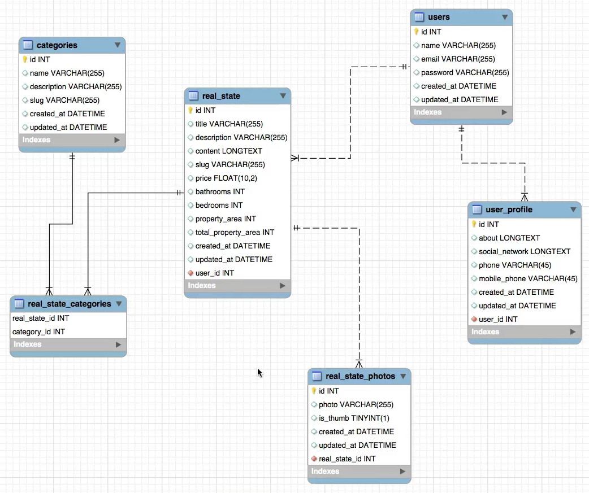

# Laravel: Construindo APIs REST

https://www.udemy.com/course/laravel-construindo-apis-rest/

Conheça os principais conceitos e implementações de sua próxima API REST com Laravel

## <a name="indice">Índice</a>

- [Laravel: Construindo APIs REST](#laravel-construindo-apis-rest)
  - [Índice](#índice)
  - [1 - Seção 1: Módulo 0](#1---seção-1-módulo-0)
  - [2 - Seção 2: WebServices, APIs, REST Conceitos](#2---seção-2-webservices-apis-rest-conceitos)
  - [3 - Seção 3: Mão na Massa: Primeira API REST](#3---seção-3-mão-na-massa-primeira-api-rest)
  - [4 - Seção 4: Laravel: Recursos para APIs](#4---seção-4-laravel-recursos-para-apis)
  - [5 - Seção 5: APIs REST: Filtros](#5---seção-5-apis-rest-filtros)
  - [6 - Seção 6: Api REST: Validações](#6---seção-6-api-rest-validações)
  - [7 - Seção 7: \[Projeto\] - Configurando Projeto](#7---seção-7-projeto---configurando-projeto)
  - [8 - Seção 8: \[Projeto\] - Endpoint de Imóveis](#8---seção-8-projeto---endpoint-de-imóveis)
  - [9 - Seção 9: Endpoints: /users \& /categories](#9---seção-9-endpoints-users--categories)
  - [10 - Seção 10: Relacionamento Muitos para Muitos: Categ…](#10---seção-10-relacionamento-muitos-para-muitos-categ)
  - [11 - Seção 11: Relacionamento Usuário e Perfil](#11---seção-11-relacionamento-usuário-e-perfil)
  - [12 - Seção 12: Imóvel: Upload de Imagens](#12---seção-12-imóvel-upload-de-imagens)
  - [13 - Seção 13: Conhecendo o JWT (Json Web Token)](#13---seção-13-conhecendo-o-jwt-json-web-token)
  - [14 - Seção 14: Autenticação \& JWT em Nossa API de Imó…](#14---seção-14-autenticação--jwt-em-nossa-api-de-imó)
  - [15 - Seção 15: Busca de Imóveis](#15---seção-15-busca-de-imóveis)
  - [16 - Seção 16: Conclusões](#16---seção-16-conclusões)
  - [17 - Seção 17: Extra: Migrando Versões Laravel](#17---seção-17-extra-migrando-versões-laravel)
  - [Ver composer.json das pastas!](#ver-composerjson-das-pastas)
---


## <a name="parte1">1 - Seção 1: Módulo 0</a>

- 1 Introdução
- 2 Quem sou eu?
- 3 Ambiente & Links Importantes
- 4 Importante - Links

[Voltar ao Índice](#indice)

---


## <a name="parte2">2 - Seção 2: WebServices, APIs, REST Conceitos</a>

- 5 Protocolo HTTP

  - Verbos
    - GET
    - PUT
    - POST
    - PATCH
    - DELET
    - OPTIONS
    - ...

  - Status code
    - 200: success
    - 300: Redirect
    - 400: Client Error
    - 500: Server Error

- 6 O que são WebServices?
 


  - SOAP - WSDL
  - REST
  - RCP
  - GRAPHQL
  
- 7 Webservices X APIs


- 8 REST: O que é?


- 9 Conhecendo mais o REST por meio do consumo de uma API REST


[Voltar ao Índice](#indice)

---


## <a name="parte3">3 - Seção 3: Mão na Massa: Primeira API REST</a>

- 10 Iniciando API com Laravel

  - [api-01-app](api-01-app)
  - [Revisão - api-03-app](/api-03-app)

- [api-01-app/routes/api.php](api-01-app/routes/api.php)

```php
Route::get('/test', function (Request $request){

    //dd($request->headers->get('Authorization'));
    //dd($request->headers->all());

    $response = new \Illuminate\Http\Response(
        json_encode(['msg' => 'Minha primeira Resposta de API']));
    $response->header('Content-Type', 'application/json');

    return $response;
});

```

- 11 Configurando base para API
 
- 12 Criando Primeiro Endpoint

- 13 Criando & Recuperando Produto

- 14 Atualizando Produto

- 15 Removendo Produto


[Voltar ao Índice](#indice)

---


## <a name="parte4">4 - Seção 4: Laravel: Recursos para APIs</a>

- 16 Introdução

```php
 public function index()
    {
        $products = $this->product->paginate(1);

        return response()->json($products);
    }
```

```json
{
  "current_page": 1,
  "data": [
    {
      "id": 3,
      "name": "Ed Produto0001 Editadp",
      "prive": 59.99,
      "descripption": "Descrição do produto 0001 Editado",
      "slug": "produto0001Editado",
      "created_at": "2021-10-26T15:58:03.000000Z",
      "updated_at": "2021-10-26T16:00:54.000000Z"
    }
  ],
  "first_page_url": "http://localhost/api/products?page=1",
  "from": 1,
  "last_page": 2,
  "last_page_url": "http://localhost/api/products?page=2",
  "links": [
    {
      "url": null,
      "label": "&laquo; Previous",
      "active": false
    },
    {
      "url": "http://localhost/api/products?page=1",
      "label": "1",
      "active": true
    },
    {
      "url": "http://localhost/api/products?page=2",
      "label": "2",
      "active": false
    },
    {
      "url": "http://localhost/api/products?page=2",
      "label": "Next &raquo;",
      "active": false
    }
  ],
  "next_page_url": "http://localhost/api/products?page=2",
  "path": "http://localhost/api/products",
  "per_page": 1,
  "prev_page_url": null,
  "to": 1,
  "total": 2
}
```

- 17 Controllers como Recurso

```
$ php artisan make:controller UserController --resource --api
Controller created successfully.
```

```php
class UserController extends Controller
{
    /**
     * Display a listing of the resource.
     *
     * @return \Illuminate\Http\Response
     */
    public function index()
    {
        //
    }

    /**
     * Store a newly created resource in storage.
     *
     * @param  \Illuminate\Http\Request  $request
     * @return \Illuminate\Http\Response
     */
    public function store(Request $request)
    {
        //
    }

    /**
     * Display the specified resource.
     *
     * @param  int  $id
     * @return \Illuminate\Http\Response
     */
    public function show($id)
    {
        //
    }

    /**
     * Update the specified resource in storage.
     *
     * @param  \Illuminate\Http\Request  $request
     * @param  int  $id
     * @return \Illuminate\Http\Response
     */
    public function update(Request $request, $id)
    {
        //
    }

    /**
     * Remove the specified resource from storage.
     *
     * @param  int  $id
     * @return \Illuminate\Http\Response
     */
    public function destroy($id)
    {
        //
    }
}
```

```
php artisan route:list
+--------+-----------+----------------------+--------------+------------------------------------------------------------+------------+
| Domain | Method    | URI                  | Name         | Action                                                     | Middleware |
+--------+-----------+----------------------+--------------+------------------------------------------------------------+------------+
|        | GET|HEAD  | /                    |              | Closure                                                    | web        |
|        | GET|HEAD  | api/products         |              | App\Http\Controllers\Api\ProductController@index           | api        |
|        | POST      | api/products         |              | App\Http\Controllers\Api\ProductController@save            | api        |
|        | PUT       | api/products         |              | App\Http\Controllers\Api\ProductController@update          | api        |
|        | PATCH     | api/products         |              | App\Http\Controllers\Api\ProductController@update          | api        |
|        | GET|HEAD  | api/products/{id}    |              | App\Http\Controllers\Api\ProductController@show            | api        |
|        | DELETE    | api/products/{id}    |              | App\Http\Controllers\Api\ProductController@delete          | api        |
|        | GET|HEAD  | api/test             |              | Closure                                                    | api        |
|        | GET|HEAD  | api/user             | user.index   | App\Http\Controllers\Api\UserController@index              | api        |
|        | POST      | api/user             | user.store   | App\Http\Controllers\Api\UserController@store              | api        |
|        | GET|HEAD  | api/user/create      | user.create  | App\Http\Controllers\Api\UserController@create             | api        |
|        | GET|HEAD  | api/user/{user}      | user.show    | App\Http\Controllers\Api\UserController@show               | api        |
|        | PUT|PATCH | api/user/{user}      | user.update  | App\Http\Controllers\Api\UserController@update             | api        |
|        | DELETE    | api/user/{user}      | user.destroy | App\Http\Controllers\Api\UserController@destroy            | api        |
|        | GET|HEAD  | api/user/{user}/edit | user.edit    | App\Http\Controllers\Api\UserController@edit               | api        |
|        | GET|HEAD  | sanctum/csrf-cookie  |              | Laravel\Sanctum\Http\Controllers\CsrfCookieController@show | web        |
+--------+-----------+----------------------+--------------+------------------------------------------------------------+------------+


```

```php
    public function index()
    {
        return response()->json(['message'=> __METHOD__]); // testar métodos
    }
```

- 18 Eloquent Api Resource

```
$ php artisan make:resource ProductResource
Resource created successfully.

```

- [api-01-app/app/Http/Resources/ProductResource.php](api-01-app/app/Http/Resources/ProductResource.php)

```php
public function toArray($request)
    {
        // return parent::toArray($request);
        /* return [
            'name' => $this->name,
            'prive'=> $this->prive,
            'slug' => $this->slug
        ]; */
        return $this->resource->toArray();
    }
```

- [api-01-app/app/Http/Controllers/Api/ProductController.php](api-01-app/app/Http/Controllers/Api/ProductController.php)

```php
    public function show($id)
    {
        $product = $this->product->find($id);
        // return response()->json(['message' => __METHOD__]);
        return new ProductResource($product);
    }
```
- 19 Eloquent Api Resource pt. 2

```
$ php artisan make:resource ProductCollection
Resource collection created successfully.

```


```php
class ProductController extends Controller
{
    public function index()
    {
        // $products = $this->product->all();
        $products = $this->product->paginate(2);

        //return response()->json($products);
        return new ProductCollection($products);
    }
```

```php
class ProductCollection extends ResourceCollection
{
    public function toArray(Request $request): array
    {
        // return parent::toArray($request);

        return [
            'data' => $this->collection,
            'extra_1' => 'Dado adicional no toArray'
        ];
    }
    public function with(Request $request)
    {
        // return parent::with($request); // TODO: Change the autogenerated stub
        return [
            'extra_information' => 'Another Data',
            'extra_2' => 'Dado adicional'
        ];
    }
}
```

- [api-01-app/app/Providers/AppServiceProvider.php](api-01-app/app/Providers/AppServiceProvider.php)

```php
    public function boot()
    {
        JsonResource::withoutWrapping();
        JsonResource::wrap('view');
    }
}
```

- 20 Autenticação Básica

```
$ php artisan make:seeder UsersTableSeeder
Seeder created successfully.

```

- [api-01-app/database/seeders/UsersTableSeeder.php](api-01-app/database/seeders/UsersTableSeeder.php)

```php
 public function run()
    {
        factory(\App\User::class, 1)->create();
    }
```

- [api-01-app/database/seeders/DatabaseSeeder.php](api-01-app/database/seeders/DatabaseSeeder.php)

```php
 public function run()
    {
         \App\Models\User::factory(10)->create();
    }
```

```
$ php artisan db:seed
Database seeding completed successfully.

```


[Voltar ao Índice](#indice)

---


## <a name="parte5">5 - Seção 5: APIs REST: Filtros</a>

- 21 Introdução

```
$ php artisan make:factory ProductFactory
Factory created successfully.

$ php artisan make:seeder ProductTableSeeder
Seeder created successfully.

```

- 22 Iniciando Filtragem de Campos

- [api-01-app/app/Http/Controllers/Api/ProductController.php](api-01-app/app/Http/Controllers/Api/ProductController.php)

```php
 public function index(Request $request)
    {
        $products = $this->product;

        if ($request->has('fields')) {
            $field = $request->get('fields');
            $products = $products->selectRaw($field);
        }

        //$products = $this->product->paginate(4);
        //return response()->json($products);
        return new ProductCollection($products->paginate(5));
    }
```

- 23 Adicionando Condições na Filtragem

- [api-01-app/app/Http/Controllers/Api/ProductController.php](api-01-app/app/Http/Controllers/Api/ProductController.php)

```
public function index(Request $request)
    {
        $products = $this->product;

        if ($request->has('conditions')) {
            $expressions = explode(';', $request->get('conditions'));
            foreach ($expressions as $e) {
                $exp = explode('=', $e);
                $products = $products->where($exp[0], $exp[1]);
            }
        }

        if ($request->has('fields')) {
            $fields = $request->get('fields');
            $products = $products->selectRaw($fields);
        }

        //$products = $this->product->paginate(4);
        //return response()->json($products);
        return new ProductCollection($products->paginate(5));
    }
```

- 24 Melhorando Condições nas Filtragens

- [Http/Controllers/Api/ProductController.php](Http/Controllers/Api/ProductController.php)

```php
 public function index(Request $request)
    {
        $products = $this->product;

        if ($request->has('conditions')) {
            $expressions = explode(';', $request->get('conditions'));
            foreach ($expressions as $e) {
                $exp = explode(':', $e);
                $products = $products->where($exp[0], $exp[1], $exp[2]);
            }
        }

        if ($request->has('fields')) {
            $fields = $request->get('fields');
            $products = $products->selectRaw($fields);
        }

        //$products = $this->product->paginate(4);
        //return response()->json($products);
        return new ProductCollection($products->paginate(5));
    }

```

```
http://localhost/api/products?fields=id,name,prive&conditions=name:like:%Produto%
```

- 25 Melhorias nos Filtros Criando Repository

- 26 Melhorias no Repository

- 27 Criando AbstractRepository

```php
class AbstractRepository
{
    /**
     * @var Model
     */
    private $model;

    public function __construct(Model $model)
    {
        $this->model = $model;
    }

    public function selectCoditions($coditions)
    {
        $expressions = explode(';', $coditions);
        foreach($expressions as $e) {
            $exp = explode(':', $e);

            $this->model = $this->model->where($exp[0], $exp[1], $exp[2]);
        }
    }

    public function selectFilter($filters)
    {
        $this->model = $this->model->selectRaw($filters);
    }

    public function getResult()
    {
        return $this->model;
    }
}
```

```php
class ProductRepository extends AbstractRepository
{
}
```

```php
public function index(Request $request)
    {
        $products = $this->product;
        $productRespository = new ProductRepository($products);

        if($request->has('coditions')) {
            $productRespository->selectCoditions($request->get('coditions'));
        }

        if($request->has('fields')) {
            $productRespository->selectFilter($request->get('fields'));
        }

        //return response()->json($products);
        return new ProductCollection($productRespository->getResult()->paginate(10));
    }
```


[Voltar ao Índice](#indice)

---


## <a name="parte6">6 - Seção 6: Api REST: Validações</a>

- 27 - Introdução
- 28 - Iniciando Validações

```
 $sail php artisan make:request ProductRequest    

   INFO  Request [app/Http/Requests/ProductRequest.php] created successfully.

```

```php
class ProductRequest extends FormRequest
{
    public function authorize(): bool
    {
        return true;
    }
    public function rules(): array
    {
        return [
            'name'        => 'required',
            'price'       => 'required',
            'description' => 'required',
            'slug'        => 'required'
        ];
    }
```

- 29 - Retornando Validações em JSON
- 30 - Status Code HTTP
- 31 - Conclusões

[Voltar ao Índice](#indice)

---


## <a name="parte7">7 - Seção 7: [Projeto] - Configurando Projeto</a>

- 32 - Conhecendo o Projeto



- 33 - Iniciando Projeto MeuImovel

```
curl -s "https://laravel.build/meuImovel?with=mysql" | bash

```

- 34 - Configurando BD & Iniciando Migrations

```
 sail php artisan make:migration create_table_real_state --create=real_state        

   INFO  Migration [database/migrations/2023_08_28_114624_create_table_real_state.php] created successfully. 

sail php artisan make:migration create_table_categories --create=categories

   INFO  Migration [database/migrations/2023_08_28_114732_create_table_categories.php] created successfully. 

sail php artisan make:migration create_table_real_state_photos --create=real_state_photos 

   INFO  Migration [database/migrations/2023_08_28_114901_create_table_real_state_photos.php] created successfully.

sail php artisan make:migration create_table_user_profile --create=user_profile

   INFO  Migration [database/migrations/2023_08_28_114950_create_table_user_profile.php] created successfully.
```


- 35 - Preparando Migrações das Tabelas
- 36 - Criando Associações & Relacionamentos
- 37 - Tabela Pivot & Executando Migrações, Concluindo Etapa

```
 sail php artisan make:migration create_table_real_state_categories --create=real_state_
categories

   INFO  Migration [database/migrations/2023_08_28_232448_create_table_real_state_categories.php] created successfully. 
```

```php
Schema::create('real_state', function (Blueprint $table) {
            $table->id();

            $table->unsignedBigInteger('user_id');

            $table->string('title');
            $table->string('description');
            $table->text('content');
            $table->float('price', 10, 2);
            $table->integer('bathrooms');
            $table->integer('dedrooms');
            $table->integer('property_area');
            $table->integer('total_property_area');
            $table->string('slug');

            $table->timestamps();

            $table->foreign('user_id')->references('id')->on('users');

        });
```

```php
Schema::create('categories', function (Blueprint $table) {
            $table->id();

            $table->string('name');
            $table->string('description');
            $table->string('slug');

            $table->timestamps();
        });
```

```php
Schema::create('real_state_photos', function (Blueprint $table) {
            $table->id();

            $table->unsignedBigInteger('real_state_id');

            $table->string('photo');
            $table->boolean('is_thumb');

            $table->timestamps();

            $table->foreign('real_state_id')->references('id')->on('real_state');
        });
```

```php
Schema::create('user_profile', function (Blueprint $table) {
            $table->id();

            $table->unsignedBigInteger('user_id');

            $table->text('about')->nullable(true);
            $table->text('social_networks')->nullable(true);
            $table->string('phone')->nullable(true);
            $table->string('mobile_phone')->nullable(true);

            $table->timestamps();

            $table->foreign('user_id')->references('id')->on('users');
        });
```

```php
Schema::create('real_state_categories', function (Blueprint $table) {
            // $table->id();
            // $table->timestamps();

            $table->unsignedBigInteger('real_state_id');
            $table->unsignedBigInteger('category_id');

            $table->foreign('real_state_id')->references('id')->on('real_state');
            $table->foreign('category_id')->references('id')->on('categories');


        });
```

[Voltar ao Índice](#indice)

---


## <a name="parte8">8 - Seção 8: [Projeto] - Endpoint de Imóveis</a>

- 38 Inciando Endpoint

```
sail php artisan make:model RealState   

   INFO  Model [app/Models/RealState.php] created successfully.  

 sail php artisan make:controller Api/RealStateController            

   INFO  Controller [app/Http/Controllers/Api/RealStateController.php] created successfully.

```

```php
namespace App\Models;

use Illuminate\Database\Eloquent\Factories\HasFactory;
use Illuminate\Database\Eloquent\Model;

class RealState extends Model
{
    use HasFactory;

    protected $table = 'real_state';
    public function user()
    {
        // return $this->belongsTo(User::class, 'user_id'); // com foregin id

        return $this->belongsTo(User::class);
    }
}
```

```php
namespace App\Models;
class User extends Authenticatable
{
    public function real_state()
    {
        return $this->hasMany(RealState::class);
    }
}
```

```php
namespace App\Http\Controllers\Api;

class RealStateController extends Controller
{
    private $realState;
    public function __construct(RealState $realState)
    {
        $this->realState = $realState;
    }

    public function index()
    {
        $realState = $this->realState->paginate('10');

        return response()->json($realState, 200);
    }
}

```

```php
Route::prefix('v1')->namespace('Api')->group(function () {
    Route::prefix('real-states')->name('real_states.')->group(function () {
        Route::get('/', [RealStateController::class, 'index'])->name('index'); // api/v1/real-states/
    });
});

```


- 39 Endpoint para Criação de Um Imóvel
- 40 Endpoint para Criação de Um Imóvel pt. 2

```php
class RealState extends Model
{
    use HasFactory;

    protected $table = 'real_state';

    protected $fillable = [
        'user_id', 'title', 'description', 'content', 'price',
        'slug', 'dedrooms', 'bathrooms', 'property_area', 'total_property_area'

    ];
    public function user()
    {
        // return $this->belongsTo(User::class, 'user_id'); // com foregin id

        return $this->belongsTo(User::class);
    }
}
```

```php
public function store(Request $request)
    {
        $data = $request->all();
        try {

            $this->realState->create($data);

            return response()->json([
                'data' => [
                    'msg' => 'Imóvel Cadastrado com Sucesso'
                ]
            ], 200);
        } catch (\Exception $e) {
            return response()->json(['error' => $e->getMessage(), 401]);
        }
    }
```

- 41 Endpoint para Atualização de Um Imóvel

```php
Route::prefix('v1')->namespace('Api')->group(function () {
    Route::name('real_states.')->group(function () {
        Route::resource('real-states', '\App\Http\Controllers\Api\RealStateController'); 
    });
});

```

```php
public function update($id, Request $request)
    {
        $data = $request->all();

        try {

            $realState = $this->realState->findOrFail($id);

            $realState->update($data);

            return response()->json([
                'data' => [
                    'msg' => 'Imóvel Atualizado com Sucesso'
                ]
            ], 200);
        } catch (\Exception $e) {
            return response()->json(['error' => $e->getMessage(), 401]);
        }
    }
```

- 42 Endpoints para Recuperar & Deletar um Imóvel
- 43 Form Request com Validações Imóveis

```
 sail php artisan make:request RealStateRequest

   INFO  Request [app/Http/Requests/RealStateRequest.php] created successfully.
```

```php
class RealStateRequest extends FormRequest
{
    public function authorize(): bool
    {
        return true;
    }

    public function rules(): array
    {
        return [
            'title' => 'required',
            'description' => 'required',
            'content' => 'required',
            'price' => 'required',
            'dedrooms' => 'required',
            'bathrooms' => 'required',
            'property_area' => 'required',
            'total_property_area' => 'required'
        ];
    }
```


- 44 ApiMessages para mensagens de Erro & Concluindo

```php
class ApiMessages
{
    private $message = [];

    public function __construct(string $message, array $data = [])
    {
        $this->message['message'] = $message;
        $this->message['errors'] = $data;
    }

    public function getMessage()
    {
        return $this->message;
    }
}
```

```php
public function store(RealStateRequest $request)
    {
        $data = $request->all();
        try {

            $this->realState->create($data);

            return response()->json([
                'data' => [
                    'msg' => 'Imóvel Cadastrado com Sucesso'
                ]
            ], 200);
        } catch (\Exception $e) {
            $message = new ApiMessages($e->getMessage());
            return response()->json($message->getMessage(), 401);
        }
    }
```


[Voltar ao Índice](#indice)

---


## <a name="parte9">9 - Seção 9: Endpoints: /users & /categories</a>

45 - Endpoint de Usuários

```
sail php artisan make:controller Api/UserController --resource --api

   INFO  Controller [app/Http/Controllers/Api/UserController.php] created successfully.  

```

```
sail php artisan make:request UserRequest                           

   INFO  Request [app/Http/Requests/UserRequest.php] created successfully.  

```

```php
class UserRequest extends FormRequest
{
    public function authorize(): bool
    {
        return true;
    }

    public function rules(): array
    {
        return [
            [
                'name' => ['required', 'string', 'max:255'],
                'email' => ['required', 'string', 'email', 'max:255', 'unique:users'],
                'password' => ['string', 'max:255', 'min:8', 'confirmed'],
            ]
        ];
    }
}
```

```php
<?php
namespace App\Http\Controllers\Api;
class UserController extends Controller
{
    public function store(Request $request)
    {
        $data = $request->all();

        if (!$request->has('password') || !$request->get('password')) {
            $message = new ApiMessages('É necessário informar uma SENHA para o Usuário');
            return response()->json($message->getMessage(), 401);
        }

        try {

            $data['password'] = bcrypt($data['password']);

            $user = $this->user->create($data);

            return response()->json([
                'data' => [
                    'msg' => 'Usuário Cadastrado com Sucesso'
                ]
            ], 200);
        } catch (\Exception $e) {
            $message = new ApiMessages($e->getMessage());
            return response()->json($message->getMessage(), 401);
        }
    }


    public function update(Request $request, int $id)
    {
        $data = $request->all();

        if ($request->has('password') && $request->get('password')) {
            $data['password'] = bcrypt($data['password']);
        }else{
            unset($data['password']);
        }

        try {

            $user = $this->user->findOrFail($id);

            $user->update($data);

            return response()->json([
                'data' => [
                    'msg' => 'Usuário Atualizado com Sucesso'
                ]
            ], 200);
        } catch (\Exception $e) {
            $message = new ApiMessages($e->getMessage());
            return response()->json($message->getMessage(), 401);
        }
    }

```


46 - Endpoint de Categorias

```
 sail php artisan make:controller Api/CategoryController --resource --api

   INFO  Controller [app/Http/Controllers/Api/CategoryController.php] created successfully.

sail php artisan make:model Category                                    

   INFO  Model [app/Models/Category.php] created successfully.

```


[Voltar ao Índice](#indice)

---


## <a name="parte10">10 - Seção 10: Relacionamento Muitos para Muitos: Categ…</a>

- 47 Iniciando Relação Models Imóveis e Categorias
- 48 Salvando & Atualizando Relação
- 49 Recuperando Imóveis por Categorias

```php
    Route::name('categories.')->group(function () {
        Route::get('categories/{id}/real-states', [CategoryController::class, 'realState']);
        Route::resource('categories', '\App\Http\Controllers\Api\CategoryController');
    });
```

```php
<?php

class CategoryController extends Controller
{
    // ...
    public function realState(int $id  )
    {
        try{
            $category = $this->category->findOrFail($id);

            return response()->json([
                'data' => $category->realStates
            ], 200);

        } catch (\Exception $e) {
            $message = new ApiMessages($e->getMessage());
            return response()->json($message->getMessage(), 401);
        }
    }
}

```


[Voltar ao Índice](#indice)

---


## <a name="parte11">11 - Seção 11: Relacionamento Usuário e Perfil</a>

- 50 Mapeando Relação

```
 sail php artisan make:model UserProfile      

   INFO  Model [app/Models/UserProfile.php] created successfully.

```

```php
class UserProfile extends Model
{
    use HasFactory;

    protected $fillable = ['about', 'social_networks', 'phone', 'mobile_phone'];

    public function user()
    {
        return $this->belongsTo(User::class);
    }
```

```php
class User extends Authenticatable
{
//...
    public function profile()
    {
        return $this->hasOne(UserProfile::class);
    }
}
```

- 51 Criando Perfil do Usuário

```php
class UserController extends Controller
{
    public function store(Request $request)
    {
        $data = $request->all();

        if (!$request->has('password') || !$request->get('password')) {
            $message = new ApiMessages('É necessário informar uma SENHA para o Usuário');
            return response()->json($message->getMessage(), 401);
        }

        Validator::make($data, [
            'phone' => 'required',
            'mobile_phone' => 'required'
        ])->validate();

        try {

            $data['password'] = bcrypt($data['password']);

            $user = $this->user->create($data);

            $user->profile()->create(
                [
                    'phone' => $data['phone'],
                    'mobile_phone'=>$data['mobile_phone']
                ]
            );

            return response()->json([
                'data' => [
                    'msg' => 'Usuário Cadastrado com Sucesso'
                ]
            ], 200);
        } catch (\Exception $e) {
            $message = new ApiMessages($e->getMessage());
            return response()->json($message->getMessage(), 401);
        }
    }

```

- 52 Atualizando Perfil do Usuário

```php
class UserController extends Controller
{
    // ...
    public function update(Request $request, int $id)
    {
        $data = $request->all();

        if ($request->has('password') && $request->get('password')) {
            $data['password'] = bcrypt($data['password']);
        }else{
            unset($data['password']);
        }

        Validator::make($data, [
            'profile.phone' => 'required',
            'profile.mobile_phone' => 'required'
        ])->validate();

        try {

            $profile = $data['profile'];
            $profile['social_networks'] = serialize($profile['social_networks']);

            $user = $this->user->findOrFail($id);
            $user->update($data);

            $user->profile()->update($profile);

            return response()->json([
                'data' => [
                    'msg' => 'Usuário Atualizado com Sucesso'
                ]
            ], 200);
        } catch (\Exception $e) {
            $message = new ApiMessages($e->getMessage());
            return response()->json($message->getMessage(), 401);
        }
    }

```

- 53 Recuperando Usuário com Perfil

```php
class UserController extends Controller
{
    public function show(int $id)
    {
        try {

            $user = $this->user->with('profile')->findOrFail($id);
            $user->profile->social_networks = unserialize($user->profile->social_networks);


            return response()->json([
                'data' => $user
            ], 200);
        } catch (\Exception $e) {
            $message = new ApiMessages($e->getMessage());
            return response()->json($message->getMessage(), 401);
        }
    }
```

[Voltar ao Índice](#indice)

---


## <a name="parte12">12 - Seção 12: Imóvel: Upload de Imagens</a>

- 54 Iniciando Relação entre Imóveis e Fotos

```
 sail php artisan make:model RealStatePhoto 

   INFO  Model [app/Models/RealStatePhoto.php] created successfully.

```

- 55 Realizando Upload de Fotos
- 56 Salvando & Atualizando Relação Imóveis e Fotos

```php
class RealStateController extends Controller
{
//...
    public function store(RealStateRequest $request)
    {
        $data = $request->all();

        $images = $request->file('images');

        try {

            $realState = $this->realState->create($data);

            // dd($request->file('images')); // dados imagens

            if (isset($data['categories']) && count($data['categories'])) {
                $realState->categories()->sync($data['categories']);
            }

            if ($images) {

                $imagesUploaded = [];

                foreach ($images as $image) {
                    $path = $image->store('images', 'public');
                    $imagesUploaded[] = ['photo'=> $path, 'is_thumb' => false];
                }
                // dd($imagesUploaded);
                $realState->photos()->createMany($imagesUploaded);

            }

            return response()->json([
                'data' => [
                    'msg' => 'Imóvel Cadastrado com Sucesso'
                ]
            ], 200);
        } catch (\Exception $e) {
            $message = new ApiMessages($e->getMessage());
            return response()->json($message->getMessage(), 401);
        }
    }

    public function update($id, RealStateRequest $request)
    {
        $data = $request->all();

        $images = $request->file('images');

        try {

            $realState = $this->realState->findOrFail($id);
            $realState->update($data);

            if (isset($data['categories']) && count($data['categories'])) {
                $realState->categories()->sync($data['categories']);
            }

            if ($images) {

                $imagesUploaded = [];

                foreach ($images as $image) {
                    $path = $image->store('images', 'public');
                    $imagesUploaded[] = ['photo'=> $path, 'is_thumb' => false];
                }
                // dd($imagesUploaded);
                $realState->photos()->createMany($imagesUploaded);

            }

            return response()->json([
                'data' => [
                    'msg' => 'Imóvel Atualizado com Sucesso'
                ]
            ], 200);
        } catch (\Exception $e) {
            $message = new ApiMessages($e->getMessage());
            return response()->json($message->getMessage(), 401);
        }
    }
```

- 57 Endpoint para Thumb & Remoção de Imagens

```
sail php artisan make:controller Api/RealStatePhotoController                    

   INFO  Controller [app/Http/Controllers/Api/RealStatePhotoController.php] created successfully.
```

- 58 Exibindo Imagens na Single do Imóvel

[Voltar ao Índice](#indice)

---


## <a name="parte13">13 - Seção 13: Conhecendo o JWT (Json Web Token)</a>

- 59 Conhecendo o JWT
- 60 Criando Primeiro Token JWT
- 61 Como Usar o JWT

[Voltar ao Índice](#indice)

---


## <a name="parte14">14 - Seção 14: Autenticação & JWT em Nossa API de Imó…</a>

- 62 Instalando Pacote JWT no Laravel
- 63 Conhecendo Configurações do Pacote
- 64 Configurando User & Driver JWT
- 65 Endpoint Login & Gerando Token
- 66 Protegendo Rotas Para Autorização
- 67 Invalidando & Atualizando Token
- 68 Validações no Login
- 69 Retornando Imóveis por Usuário
- 70 Conclusões

[Voltar ao Índice](#indice)

---


## <a name="parte15">15 - Seção 15: Busca de Imóveis</a>

- 71 Iniciando Migrations de Localização
- 72 Migration de Endereços
- 73 Relação entre Models de Localidade
- 74 Expondo Endpoint de Busca
- 75 Busca de Imóveis
- 76 Relação de Imóveis & Endereços
- 77 Imóveis por Localidades
- 78 Concluindo Imóveis por Localidades
- 79 Single Pública Imóvei & Concluindo

[Voltar ao Índice](#indice)

---


## <a name="parte16">16 - Seção 16: Conclusões</a>

- 80 Intro
- 81 Negociação de Conteúdo
- 82 HATEOAS
- 83 Thumb do Imóvel
- 84 Obrigado!

[Voltar ao Índice](#indice)

---


## <a name="parte17">17 - Seção 17: Extra: Migrando Versões Laravel</a>

- 85 Migrando para o Laravel
- 86 Migrando para o Laravel 7

## Ver composer.json das pastas!


[Voltar ao Índice](#indice)

---

