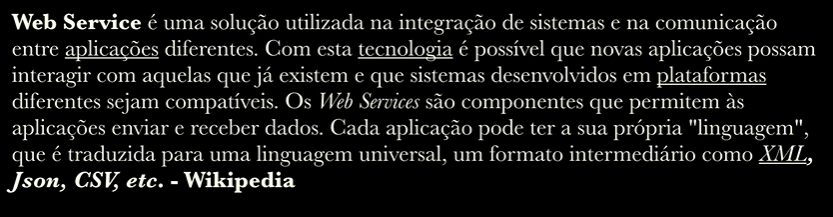
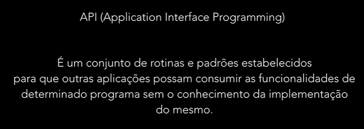
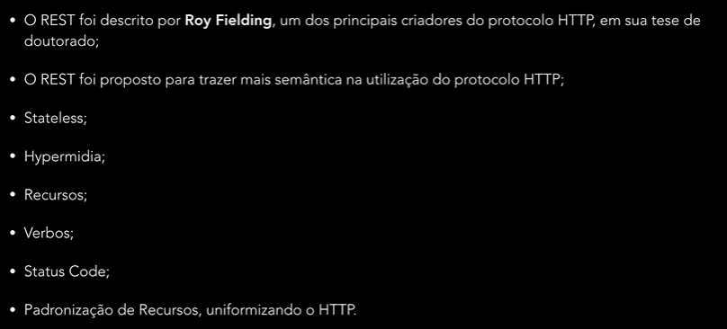
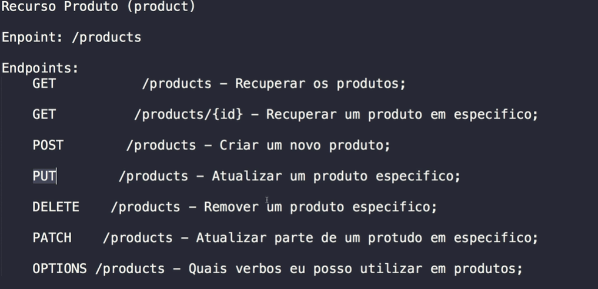

# Laravel: Construindo APIs REST

https://www.udemy.com/course/laravel-construindo-apis-rest/

Conheça os principais conceitos e implementações de sua próxima API REST com Laravel

## <a name="indice">Índice</a>

1. [Seção 1: Módulo 0](#parte1)
2. [Seção 2: WebServices, APIs, REST Conceitos](#parte2)
3. [Seção 3: Mão na Massa: Primeira API REST](#parte3)
4. [Seção 4: Laravel: Recursos para APIs](#parte4)
5. [Seção 5: APIs REST: Filtros](#parte5)
6. [Seção 6: Api REST: Validações](#parte6)
7. [Seção 7: [Projeto] - Configurando Projeto](#parte7)
8. [Seção 8: [Projeto] - Endpoint de Imóveis](#parte8)
9. [Seção 9: Endpoints: /users & /categories](#parte9)
10. [Seção 10: Relacionamento Muitos para Muitos: Categ…](#parte10)
11. [Seção 11: Relacionamento Usuário e Perfil](#parte11)
12. [Seção 12: Imóvel: Upload de Imagens](#parte12)
13. [Seção 13: Conhecendo o JWT (Json Web Token)](#parte13)
14. [Seção 14: Autenticação & JWT em Nossa API de Imó…](#parte14)
15. [Seção 15: Busca de Imóveis](#parte15)
16. [Seção 16: Conclusões](#parte16)
17. [Seção 17: Extra: Migrando Versões Laravel](#parte17)
---


## <a name="parte1">1 - Seção 1: Módulo 0</a>

- 1 Introdução
- 2 Quem sou eu?
- 3 Ambiente & Links Importantes
- 4 Importante - Links

[Voltar ao Índice](#indice)

---


## <a name="parte2">2 - Seção 2: WebServices, APIs, REST Conceitos</a>

- 5 Protocolo HTTP

  - Verbos
    - GET
    - PUT
    - POST
    - PATCH
    - DELET
    - OPTIONS
    - ...

  - Status code
    - 200: success
    - 300: Redirect
    - 400: Client Error
    - 500: Server Error

- 6 O que são WebServices?
 


  - SOAP - WSDL
  - REST
  - RCP
  - GRAPHQL
  
- 7 Webservices X APIs



- 8 REST: O que é?




- 9 Conhecendo mais o REST por meio do consumo de uma API REST



[Voltar ao Índice](#indice)

---


## <a name="parte3">3 - Seção 3: Mão na Massa: Primeira API REST</a>

- 10 Iniciando API com Laravel

  - [api-01-app](api-01-app)

- [api-01-app/routes/api.php](api-01-app/routes/api.php)

```php
Route::get('/test', function (Request $request){

    //dd($request->headers->get('Authorization'));
    //dd($request->headers->all());

    $response = new \Illuminate\Http\Response(
        json_encode(['msg' => 'Minha primeira Resposta de API']));
    $response->header('Content-Type', 'application/json');

    return $response;
});

```

- 11 Configurando base para API

- 12 Criando Primeiro Endpoint

- 13 Criando & Recuperando Produto

- 14 Atualizando Produto

- 15 Removendo Produto


[Voltar ao Índice](#indice)

---


## <a name="parte4">4 - Seção 4: Laravel: Recursos para APIs</a>


[Voltar ao Índice](#indice)

---


## <a name="parte5">5 - Seção 5: APIs REST: Filtros</a>


[Voltar ao Índice](#indice)

---


## <a name="parte6">6 - Seção 6: Api REST: Validações</a>


[Voltar ao Índice](#indice)

---


## <a name="parte7">7 - Seção 7: [Projeto] - Configurando Projeto</a>


[Voltar ao Índice](#indice)

---


## <a name="parte8">8 - Seção 8: [Projeto] - Endpoint de Imóveis</a>


[Voltar ao Índice](#indice)

---


## <a name="parte9">9 - Seção 9: Endpoints: /users & /categories</a>


[Voltar ao Índice](#indice)

---


## <a name="parte10">10 - Seção 10: Relacionamento Muitos para Muitos: Categ…</a>


[Voltar ao Índice](#indice)

---


## <a name="parte11">11 - Seção 11: Relacionamento Usuário e Perfil</a>


[Voltar ao Índice](#indice)

---


## <a name="parte12">12 - Seção 12: Imóvel: Upload de Imagens</a>


[Voltar ao Índice](#indice)

---


## <a name="parte13">13 - Seção 13: Conhecendo o JWT (Json Web Token)</a>


[Voltar ao Índice](#indice)

---


## <a name="parte14">14 - Seção 14: Autenticação & JWT em Nossa API de Imó…</a>


[Voltar ao Índice](#indice)

---


## <a name="parte15">15 - Seção 15: Busca de Imóveis</a>


[Voltar ao Índice](#indice)

---


## <a name="parte16">16 - Seção 16: Conclusões</a>


[Voltar ao Índice](#indice)

---


## <a name="parte17">17 - Seção 17: Extra: Migrando Versões Laravel</a>


[Voltar ao Índice](#indice)

---

